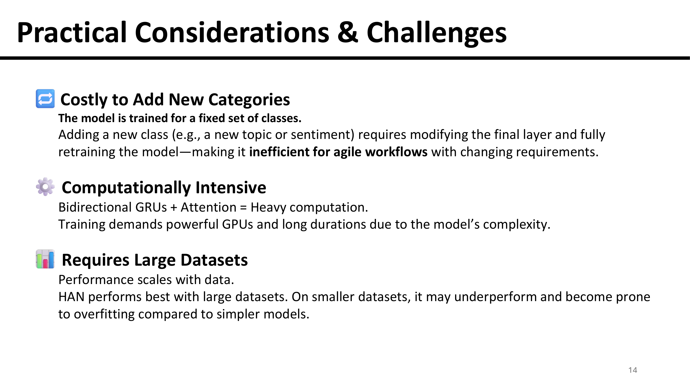

# Hierarchical Attention Networks (HAN) for Document Classification

> **Paper**: Hierarchical Attention Networks for Document Classification (2016)  
> **Authors**: Zichao Yang, Diyi Yang, Chris Dyer, Xiaodong He, Alex Smola, Eduard Hovy

📄 Research Paper: [Hierarchical Attention Networks for Document Classification](https://www.cs.cmu.edu/~hovy/papers/16HLT-hierarchical-attention-networks.pdf)

#### 🎥 Video Presentation
[HAN Document Classification Presentation](https://www.youtube.com/watch?v=JfgFRSjEucE&t=43s&ab_channel=PamuduRanasinghe)

## Model Overview
**Key Features of this approach:**
- Hierarchical document structure modeling (words → sentences → documents)
- Dual attention mechanisms for words and sentences
- Superior performance on document classification tasks
- Interpretable attention weights for understanding model decisions

### 💡 Key Innovation

> *"This hierarchical approach mirrors human reading comprehension with sentences followed by words and gives attention to important words and sentences. Very creative idea!"*

## 📖 References

1. **Yang, Z., Yang, D., Dyer, C., He, X., Smola, A., & Hovy, E.** (2016). *Hierarchical Attention Networks for Document Classification*. In Proceedings of NAACL-HLT. [[PDF]](https://www.cs.cmu.edu/~hovy/papers/16HLT-hierarchical-attention-networks.pdf)
2. **Medentsiy, V.** *Document Representations*. University of Amsterdam. [[Slides]](https://cl-illc.github.io/semantics/resources/slides/DocumentRepresentations.pdf)

**📧 Contact**: For questions or collaborations, feel free to reach out through the YouTube channel or GitHub.

**⭐ Star this repository** if you find it helpful for your research or studies!

`You are welcome to use any of the slides, vector images, and SVG image codes for your academic work.`

## 🖼️ Presentation Slides

